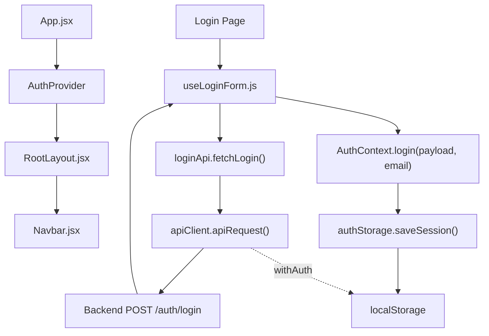
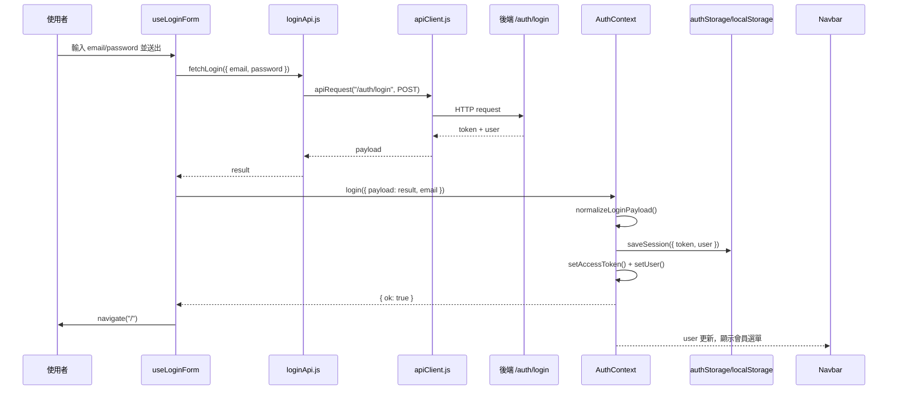
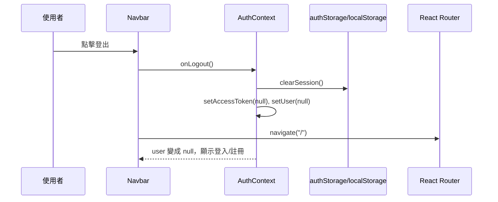

# Auth / Session 教學文件

這份文件用目前專案的實作說明登入 session 的資料流。重點是分清楚三件事：

1. 哪裡呼叫後端登入 API。
2. 哪裡接收後端回傳的 token。
3. 哪裡只是開發用假登入狀態，不是真的後端資料。

---

## 1. 相關檔案角色

| 檔案 | 角色 | 主要負責 |
| --- | --- | --- |
| `src/app/App.jsx` | Provider 入口 | 用 `AuthProvider` 包住整個 App，讓內部元件都可以用 auth 狀態 |
| `src/app/contexts/AuthContext.jsx` | Auth 狀態中心 | 管理 `user`、`accessToken`、`isAuthenticated`、`login()`、`logout()` |
| `src/features/auth/utils/authStorage.js` | Session 儲存工具 | 把 token/user 寫入或清除 `localStorage` |
| `src/features/auth/hooks/useLoginForm.js` | 登入表單流程 | 呼叫登入 API，成功後呼叫 `AuthContext.login()` |
| `src/features/auth/services/loginApi.js` | 登入 API service | 呼叫 `POST /auth/login` |
| `src/app/api/apiClient.js` | 共用 API client | 統一處理 base URL、JSON body、錯誤、Authorization header |
| `src/layouts/RootLayout.jsx` | 讀取 auth 狀態 | 用 `useAuth()` 取得 `user` 和 `logout`，傳給 Navbar |
| `src/components/navbar/Navbar.jsx` | 顯示登入狀態 | 有 `user` 就顯示會員選單，沒有 `user` 就顯示登入/註冊 |
| `.env.example` | 開發環境設定範例 | 定義 API base URL、mock fallback、dev mock auth 開關 |

---

## 2. 整體關係圖



簡單說：

- 登入頁面送帳密。
- `loginApi.js` 負責打後端。
- 後端回傳 token。
- `useLoginForm.js` 把後端 response 丟給 `AuthContext.login()`。
- `AuthContext.login()` 抽出 token/user，存進 React state 和 `localStorage`。
- 之後其他 API 如果設定 `withAuth: true`，`apiClient.js` 會從 `localStorage` 讀 token，加到 `Authorization` header。

---

## 3. 後端 token 從哪裡進來？

後端 token 的入口是：

```js
// src/features/auth/hooks/useLoginForm.js
const result = await fetchLogin({
  email: trimmedEmail,
  password,
});

const loginResult = login({ payload: result, email: trimmedEmail });
```

`fetchLogin()` 會呼叫：

```js
// src/features/auth/services/loginApi.js
return await apiRequest("/auth/login", {
  method: "POST",
  body: {
    email: email.trim(),
    password,
  },
});
```

也就是說，真正接收後端登入 response 的地方是 `useLoginForm.js`。

但是，真正解析 token、保存 session 的地方是 `AuthContext.jsx`：

```js
const login = ({ payload, email = "" }) => {
  const normalized = normalizeLoginPayload(payload, email);
  if (!normalized.token) {
    return { ok: false, reason: "missing_token" };
  }

  saveSession(normalized);
  setAccessToken(normalized.token);
  setUser(normalized.user);

  return { ok: true };
};
```

目前 `AuthContext` 可接受幾種後端格式：

```js
{
  accessToken: "...",
  user: { name: "...", email: "..." }
}
```

```js
{
  token: "...",
  user: { username: "...", email: "..." }
}
```

```js
{
  data: {
    accessToken: "...",
    user: { name: "...", email: "..." }
  }
}
```

所以後端欄位叫 `accessToken` 或 `token` 都能被吃到。

---

## 4. 假資料在哪裡？

目前要分成兩種 mock。

### 4.1 Auth dev mock session

位置：

```js
// src/app/contexts/AuthContext.jsx
const DEV_MOCK_AUTH_ENABLED =
  import.meta.env.DEV &&
  String(import.meta.env.VITE_ENABLE_DEV_MOCK_AUTH).toLowerCase() === "true";
```

如果符合條件：

- 目前是 Vite dev mode。
- `.env` 裡 `VITE_ENABLE_DEV_MOCK_AUTH=true`。
- `localStorage` 裡沒有已登入 session。

那 `AuthContext` 啟動時會建立假 session：

```js
{
  token: "dev-mock-token",
  user: {
    name: import.meta.env.VITE_DEV_MOCK_USER_NAME ?? "Demo User",
    email: import.meta.env.VITE_DEV_MOCK_USER_EMAIL ?? "demo@happyshop.dev",
  },
}
```

這個不是後端回傳的資料，也不會呼叫 `/auth/login`。它只是讓開發時可以直接看到「已登入狀態」。

### 4.2 API mock fallback

`.env.example` 裡有：

```properties
VITE_ENABLE_API_MOCK_FALLBACK=true
```

但目前搜尋程式碼後，這個 flag 是用在商品、購物車、商品詳情等頁面的資料 fallback，例如：

- `ProductSection.jsx`
- `ProductBrowserSection.jsx`
- `ProductDetailSection.jsx`
- `CartSection.jsx`

目前登入流程的 `loginApi.js` 沒有使用 `VITE_ENABLE_API_MOCK_FALLBACK`。所以登入不是「API 失敗後吃假 token」，而是直接打 `/auth/login`。

---

## 5. Session 存在哪裡？

session 存在瀏覽器的 `localStorage`。

檔案：

```js
// src/features/auth/utils/authStorage.js
const ACCESS_TOKEN_KEY = "happyShopAccessToken";
const USER_KEY = "happyShopUser";
```

保存時：

```js
saveSession({ token, user });
```

實際會寫入：

```text
localStorage["happyShopAccessToken"] = token
localStorage["happyShopUser"] = JSON.stringify(user)
```

登出時：

```js
clearSession();
```

實際會清除：

```text
happyShopAccessToken
happyShopUser
```

---

## 6. App 第一次打開時怎麼恢復登入狀態？

`AuthProvider` 初始化時會先讀 `localStorage`：

```js
const [accessToken, setAccessToken] = useState(() => {
  const storedToken = getAccessToken();
  if (storedToken) return storedToken;
  return getDevMockSession().token;
});

const [user, setUser] = useState(() => {
  const storedUser = getStoredUser();
  if (storedUser) return storedUser;
  return getDevMockSession().user;
});
```

流程是：

1. 如果 `localStorage` 有 token/user，就使用舊 session。
2. 如果沒有舊 session，且 dev mock auth 有開，就使用假 session。
3. 如果都沒有，`accessToken` 和 `user` 就是 `null`，代表未登入。

目前沒有做 token 過期檢查，也沒有呼叫後端 `/me` 或 `/profile` 驗證 token 是否仍有效。

---

## 7. Navbar 怎麼知道使用者已登入？

`App.jsx` 把 `AuthProvider` 放在最外層：

```jsx
<AuthProvider>
  <CartProvider>
    <BrowserRouter>
      ...
    </BrowserRouter>
  </CartProvider>
</AuthProvider>
```

因此 `RootLayout.jsx` 可以用：

```js
const { user, logout } = useAuth();
```

然後傳給 Navbar：

```jsx
<Navbar
  user={user}
  cartCount={cartCount}
  onLogout={logout}
/>
```

`Navbar.jsx` 裡判斷：

```js
const userMenu = user ? (
  <AuthMenu user={user} onLogout={onLogout} />
) : (
  <GuestMenu navigate={navigate} />
);
```

所以：

- `user` 有值：顯示會員選單。
- `user` 是 `null`：顯示登入 / 註冊。

---

## 8. 之後 API 怎麼帶 token？

`apiClient.js` 裡有：

```js
const finalToken = token ?? (withAuth ? getAccessToken() : null);

if (finalToken) {
  requestHeaders.Authorization = `Bearer ${finalToken}`;
}
```

意思是：

如果某個 API service 需要登入身分，要這樣寫：

```js
apiRequest("/members/me", {
  method: "GET",
  withAuth: true,
});
```

或手動指定 token：

```js
apiRequest("/members/me", {
  method: "GET",
  token: accessToken,
});
```

常用情境建議用 `withAuth: true`，讓 `apiClient` 自己從 `localStorage` 讀 `happyShopAccessToken`。

---

## 9. 登入完整流程



---

## 10. 登出完整流程



---

## 11. 目前實作的限制

目前 auth/session 已經可以做到：

- 登入成功後保存 token。
- 重新整理頁面後從 `localStorage` 恢復登入狀態。
- Navbar 根據 `user` 顯示會員選單或登入/註冊。
- 登出時清掉 token/user。
- 需要授權的 API 可用 `withAuth: true` 自動帶 Bearer token。

但目前還沒有做到：

- token 過期檢查。
- refresh token。
- App 啟動時呼叫後端驗證目前 token。
- 401/403 時自動登出。
- Route guard，例如未登入不能進 `/checkout` 或 `/account`。

---

## 12. 快速判斷：我現在看到的資料是哪一種？

| 看到的狀態 | 來源 |
| --- | --- |
| 登入表單送出後出現會員選單 | 後端 `/auth/login` 回傳 token/user，再由 `AuthContext.login()` 保存 |
| 沒登入但一開網站就像登入了 | 可能是 `localStorage` 還有舊 session，或 `VITE_ENABLE_DEV_MOCK_AUTH=true` |
| token 是 `dev-mock-token` | 這是 `AuthContext` 的 dev mock auth，不是後端 token |
| 商品列表 API 失敗但畫面仍有資料 | 可能是 `VITE_ENABLE_API_MOCK_FALLBACK=true` 的頁面 fallback |
| 登出後會員選單消失 | `AuthContext.logout()` 清掉 React state 和 `localStorage` |

---

## 13. 建議開發檢查方式

1. 開瀏覽器 DevTools。
2. 到 Application / Local Storage。
3. 找這兩個 key：

```text
happyShopAccessToken
happyShopUser
```

4. 登入前應該不存在。
5. 登入成功後應該出現。
6. 登出後應該被清除。

如果想測 dev mock auth，可以在本機 `.env` 設：

```properties
VITE_ENABLE_DEV_MOCK_AUTH=true
VITE_DEV_MOCK_USER_NAME=Demo User
VITE_DEV_MOCK_USER_EMAIL=demo@happyshop.dev
```

然後重啟 Vite dev server。注意：如果 `localStorage` 已經有正式 session，會優先使用 `localStorage`，不會使用 dev mock session。
