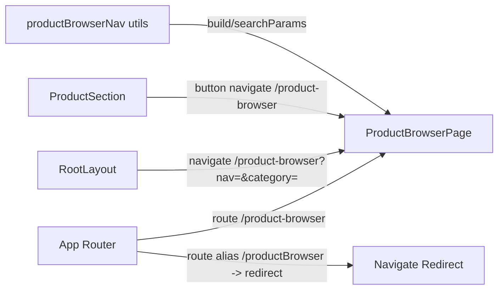
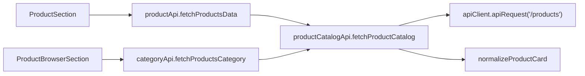
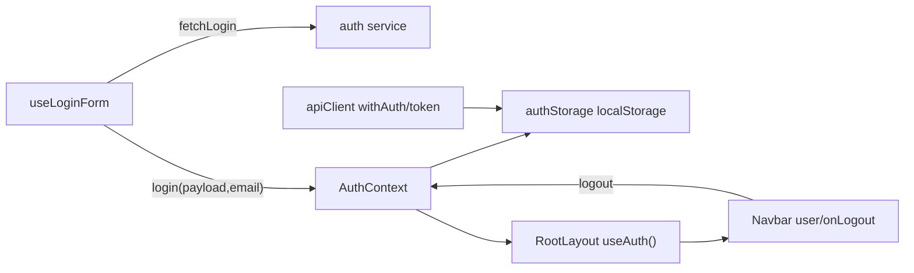
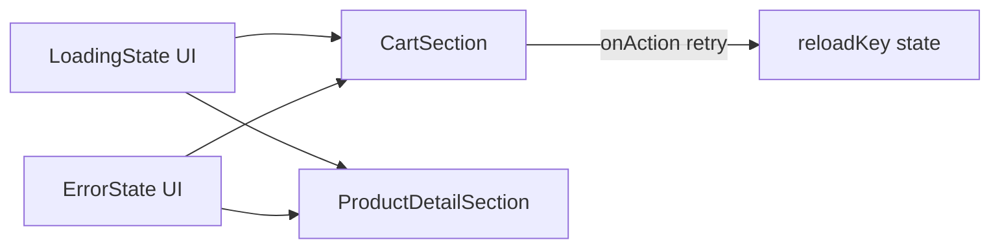
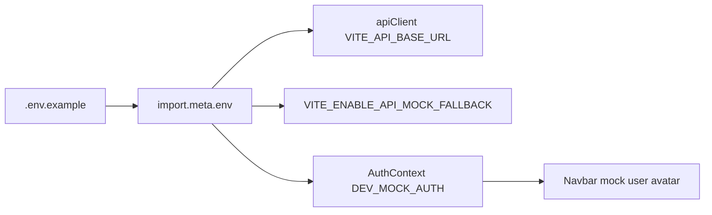
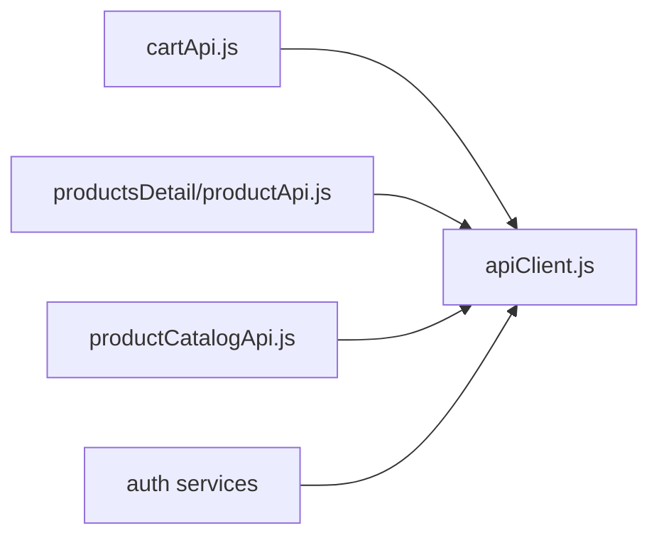
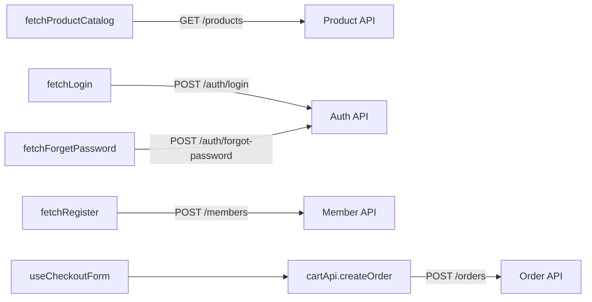
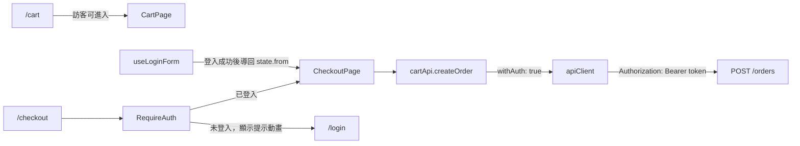

# HappyShop 前端 1~5 重構紀錄檔（含關聯圖與實作範例）

> 本文件整理近期完成的 1~5 點改善，包含：  
> 1) 統一路由命名  
> 2) 拆分 service 重複邏輯  
> 3) 補齊 auth/session 全域狀態  
> 4) 建立共用 loading/error 元件  
> 5) 新增 `.env.example`

## 版本紀錄

| 版本 | 日期 | 主要內容 |
| --- | --- | --- |
| v1 | 2026-06-25 | 完成 1~5 點改善：路由命名統一、service 去重、auth/session 全域化、共用 loading/error 元件、`.env.example` 建立。 |
| v2 | 2026-06-25 | 追加修正：API client 單檔化（統一 `apiClient.js`）、endpoint 命名收斂（`/products`、`/auth/login`、`/members`、`/auth/forgot-password`、`/orders`）。 |
| v3 | 2026-06-26 | 追加修正：訪客可使用購物車、`/checkout` 需登入、登入後導回原頁、建立訂單 API 帶 Bearer token、未登入結帳提示動畫。 |

---

## 1) 統一路由路徑命名：`/productBrowser` -> `/product-browser`

### 改動目的
- 統一路由風格為 kebab-case，避免 camelCase/kebab-case 混用。
- 保留舊路徑相容，避免既有連結失效。

### 修改檔案
- `src/app/App.jsx`
- `src/layouts/RootLayout.jsx`
- `src/features/product/sections/ProductSection.jsx`
- `src/features/productBrowser/utils/productBrowserNav.js`（原本已是 `/product-browser`，此改動與其對齊）

### 關聯架構圖


### 實作範例（Before -> After）
```jsx
// Before (概念)：只有新版或舊版其中一個，容易造成舊連結失效
// <Route path="/product-browser" ... />

// After: 保留新版 + 舊路徑相容轉址
<Route path="/product-browser" element={<ProductBrowserPage />} />
<Route
  path="/productBrowser"
  element={<Navigate to="/product-browser" replace />}
/>
```

```jsx
// RootLayout 導頁也統一用 kebab-case
const url = `/product-browser?nav=${navKey}&category=${firstKey || ""}`;
navigate(url);
```

---

## 2) 拆分 service 重複邏輯：避免 `productApi` 與 `categoryApi` 重複

### 改動目的
- 商品清單 API 呼叫與 normalize 原先重複散落在兩份 service。
- 集中後，後端欄位變更只需改一處。

### 修改檔案
- `src/features/product/services/productCatalogApi.js`（新增，共用核心）
- `src/features/product/services/productApi.js`（改為薄封裝）
- `src/features/productBrowser/services/categoryApi.js`（改為薄封裝）

### 關聯架構圖


### 實作範例（Before -> After）
```js
// Before (兩份檔案都各自有 normalizeProduct + apiRequest + payload.items)
// product/services/productApi.js
// productBrowser/services/categoryApi.js
// ...重複邏輯...

// After: 共用核心
// src/features/product/services/productCatalogApi.js
export async function fetchProductCatalog({ nav, category, signal } = {}) {
  const payload = await apiRequest("/products", {
    method: "get",
    query: { nav, category },
    signal,
  });
  return extractProductItems(payload).map(normalizeProductCard);
}
```

```js
// src/features/product/services/productApi.js
export async function fetchProductsData({ nav, category, signal } = {}) {
  return fetchProductCatalog({ nav, category, signal });
}

// src/features/productBrowser/services/categoryApi.js
export async function fetchProductsCategory({ nav, category, signal } = {}) {
  return fetchProductCatalog({ nav, category, signal });
}
```

---

## 3) 補齊 auth/session 層：由 layout 常數改為全域狀態

### 改動目的
- 原先 `RootLayout` 內硬編碼 `user`，無法代表真實登入狀態。
- 改為 `AuthContext` 統一管理 token/user，讓 Navbar、登入流程、登出流程一致。

### 修改檔案
- `src/app/contexts/AuthContext.jsx`（新增）
- `src/features/auth/utils/authStorage.js`（補齊存取）
- `src/app/App.jsx`（包 `AuthProvider`）
- `src/layouts/RootLayout.jsx`（改讀 `useAuth()`）
- `src/components/navbar/Navbar.jsx`（導入 `onLogout`）
- `src/features/auth/hooks/useLoginForm.js`（登入後寫入 session）
- `src/app/api/apiClient.js`（token key 相容）
- `.env.example`（補 dev mock auth 旗標）

### 關聯架構圖


### 實作範例（Before -> After）
```jsx
// Before: RootLayout 內暫時常數
const user = {
  name: "李軒毅",
  email: "b409105065@tmu.edu.tw",
};

// After: 從全域 auth 狀態取得
const { user, logout } = useAuth();
<Navbar user={user} onLogout={logout} ... />
```

```js
// src/features/auth/hooks/useLoginForm.js (After)
const result = await fetchLogin({ email: trimmedEmail, password });
const loginResult = login({ payload: result, email: trimmedEmail });
if (!loginResult.ok) {
  throw new Error("登入成功但缺少 access token");
}
navigate("/");
```

```js
// src/features/auth/utils/authStorage.js (After)
const ACCESS_TOKEN_KEY = "happyShopAccessToken";
const USER_KEY = "happyShopUser";
export function saveSession({ token, user }) { ... }
export function clearSession() { ... }
```

---

## 4) 建立錯誤與 loading 共用元件

### 改動目的
- 避免每個頁面重複寫 spinner/error 區塊，造成 UI 不一致。
- 讓可重試行為（例如購物車載入失敗）有統一樣式與呼叫方式。

### 修改檔案
- `src/components/ui/LoadingState.jsx`（新增）
- `src/components/ui/ErrorState.jsx`（新增）
- `src/features/cart/sections/CartSection.jsx`（套用）
- `src/features/productsDetail/sections/ProductDetailSection.jsx`（套用）

### 關聯架構圖


### 實作範例（Before -> After）
```jsx
// Before: 各頁各寫一組 loading div / error div
// <div className="...">正在為您準備購物車...</div>

// After: 共用元件
if (isLoading) {
  return <LoadingState message="正在為您準備購物車..." />;
}

if (loadError) {
  return (
    <ErrorState
      title="購物車載入失敗"
      message={loadError}
      actionLabel="重新載入"
      onAction={() => setReloadKey((prev) => prev + 1)}
    />
  );
}
```

```jsx
// ProductDetailSection (After)
if (isLoading) {
  return <LoadingState message="正在為您尋找商品..." className="mt-0 h-screen" />;
}
if (!product) {
  return (
    <ErrorState
      title="找不到此商品"
      message="請返回上一頁重新選擇商品。"
      className="mt-0 h-screen flex flex-col items-center justify-center"
    />
  );
}
```

---

## 5) 新增 `.env.example`：加速新成員啟動

### 改動目的
- 明確列出前端啟動必備環境變數，降低 onboarding 成本。
- 將 API base URL、mock fallback、mock auth 都文件化。

### 修改檔案
- `.env.example`
- `src/app/contexts/AuthContext.jsx`（讀取 mock auth 旗標）

### 關聯架構圖


### 實作範例（實際內容）
```properties
VITE_API_BASE_URL=http://localhost:8080/api
VITE_ENABLE_API_MOCK_FALLBACK=true
VITE_ENABLE_DEV_MOCK_AUTH=false
VITE_DEV_MOCK_USER_NAME=Demo User
VITE_DEV_MOCK_USER_EMAIL=demo@happyshop.dev
```

---

## 總結

- 1, 3, 4, 5 已讓前端在「路由一致性 / session 真實性 / UI 一致性 / 啟動可複製性」上明顯提升。
- 2 已完成共用資料層抽取，後續後端欄位異動維護成本下降。
- 現在這份調整可直接作為 team review 與 onboarding 的變更依據。

---

## 6) 後續追加修正（本輪新增）

### 6.1 API Client 統一為單檔

#### 調整內容
- 移除重複檔：`src/app/api/apiClient.jsx`
- 全專案統一改用：`src/app/api/apiClient.js`

#### 修改檔案
- `src/app/api/apiClient.jsx`（刪除）
- `src/features/cart/services/cartApi.js`
- `src/features/productsDetail/services/productApi.js`
- `doc/frontend-architecture-spec.md`（同步規範）

#### 關聯架構圖


#### 實作範例
```js
// Before
import { apiRequest } from "../../../app/api/apiClient";

// After
import { apiRequest } from "../../../app/api/apiClient.js";
```

### 6.2 API 路徑命名收斂（legacy -> REST）

#### 調整內容
- `/product` -> `/products`
- `/login` -> `/auth/login`
- `/register` -> `/members`
- `/forgetPassword` -> `/auth/forgot-password`
- `/cart/checkout` -> `/orders`（並保留前端函式別名相容）

#### 修改檔案
- `src/features/product/services/productCatalogApi.js`
- `src/features/auth/services/loginApi.js`
- `src/features/auth/services/registerApi.js`
- `src/features/auth/services/forgetPasswordApi.js`
- `src/features/cart/services/cartApi.js`
- `src/features/checkout/hooks/useCheckoutForm.js`
- `doc/frontend-architecture-spec.md`

#### 關聯架構圖


#### 實作範例
```js
// src/features/auth/services/loginApi.js
// Before: "/login"
// After:
return await apiRequest("/auth/login", { method: "POST", body: { ... } });
```

```js
// src/features/cart/services/cartApi.js
export async function createOrder({ data, signal } = {}) {
  return await apiRequest("/orders", {
    method: "post",
    body: data,
    signal,
    withAuth: true,
  });
}

// backward compatible alias
export async function submitCheckout({ data, signal } = {}) {
  return createOrder({ data, signal });
}
```

---

## 6.3 訪客購物車與結帳登入保護

### 調整目標
- 未登入使用者仍可瀏覽 `/cart`，並可使用 localStorage 購物車。
- 真正需要會員身分的流程集中在 `/checkout` 與 `/orders`。
- 未登入者進入 `/checkout` 時，先顯示「您尚未登入」提示動畫，再導到 `/login`。
- 登入成功後，回到原本想去的 `/checkout`。
- 建立訂單時，前端會帶上 `Authorization: Bearer <token>`，後端仍需驗證 token。

### 修改檔案
- `src/app/routes/RequireAuth.jsx`（新增）
- `src/app/App.jsx`
- `src/features/auth/hooks/useLoginForm.js`
- `src/features/cart/services/cartApi.js`

### 關聯架構圖


### 實作範例
```jsx
// src/app/App.jsx
<Route
  path="/checkout"
  element={
    <RequireAuth>
      <CheckoutPage />
    </RequireAuth>
  }
/>

// /cart 保持訪客可使用
<Route path="/cart" element={<CartPage />} />
```

```jsx
// src/app/routes/RequireAuth.jsx
if (!isAuthenticated) {
  return (
    <section>
      <h1>您尚未登入</h1>
      <p>請先登入會員，登入後會繼續前往結帳頁面。</p>
    </section>
  );
}
```

```js
// src/features/auth/hooks/useLoginForm.js
const from = location.state?.from;
const redirectTo = from
  ? `${from.pathname}${from.search ?? ""}${from.hash ?? ""}`
  : "/";

navigate(redirectTo, { replace: true });
```

```js
// src/features/cart/services/cartApi.js
export async function createOrder({ data, signal } = {}) {
  const payload = await apiRequest("/orders", {
    method: "post",
    body: data,
    signal,
    withAuth: true,
  });

  return payload;
}
```

### 安全性說明
- 前端 `RequireAuth` 是 UX 層保護，目的是避免未登入者直接看到結帳頁。
- 真正安全性仍由後端負責，`POST /orders` 必須驗證 Bearer token。
- 後端應在沒有 token、token 無效或過期時回傳 `401`，權限不足時回傳 `403`。
- 前端購物車資料仍存在 `happyShopCart`，登入與否不會清掉購物車內容。

### 測試提醒
如果 `.env.local` 設定：

```properties
VITE_ENABLE_DEV_MOCK_AUTH=true
```

開發環境會自動視為已登入，因此測不到未登入提示動畫。測試此流程時需改為：

```properties
VITE_ENABLE_DEV_MOCK_AUTH=false
```

並清除 localStorage：

```text
happyShopAccessToken
happyShopUser
```
