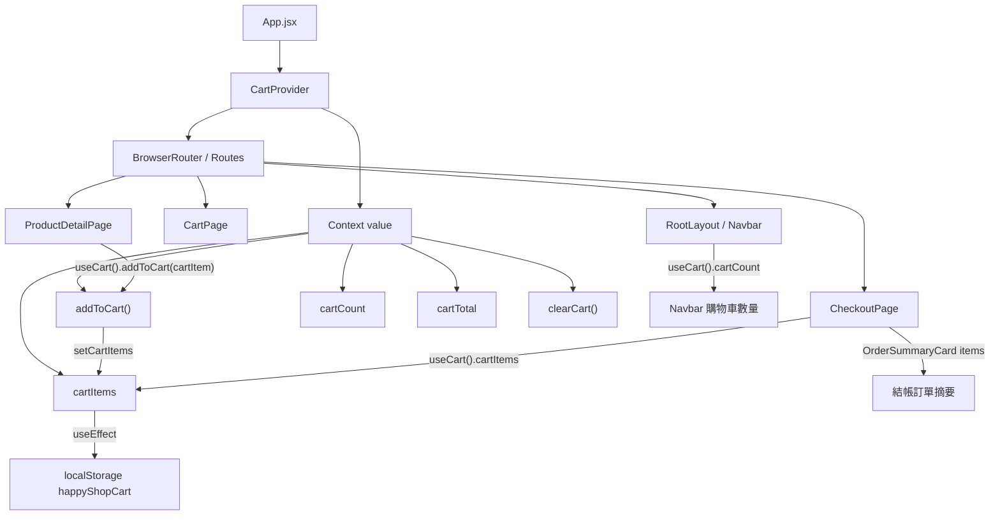

# 新增商品同步到結帳畫面資料流教學

這份文件說明：為什麼在商品詳細頁點「加入購物車」後，購物車與結帳頁面可以看到同一份商品資料。

核心觀念：

> `CartProvider` 是購物車資料的集中管理者，其他元件透過 `useCart()` 讀取或修改同一份購物車狀態。

---

## 1. 整體資料流

```text
ProductDetailSection 點加入購物車
-> 呼叫 addToCart(cartItem)
-> addToCart 其實是 CartProvider 內部提供的函式
-> CartProvider 更新 cartItems
-> cartCount / cartTotal 重新計算
-> CartProvider 把 cartItems 寫入 localStorage: happyShopCart
-> CheckoutMainSection 用 useCart() 讀取 cartItems
-> checkout 畫面顯示同一份購物車資料
```

---

## 2. 為什麼商品頁和 checkout 可以共用資料？

因為 `App.jsx` 裡面用 `CartProvider` 包住整個 Router：

```jsx
<AuthProvider>
  <CartProvider>
    <BrowserRouter>
      <Routes>
        ...
      </Routes>
    </BrowserRouter>
  </CartProvider>
</AuthProvider>
```

所以 Routes 底下的頁面都在 `CartProvider` 裡面，例如：

```text
ProductDetailPage
CartPage
CheckoutPage
RootLayout / Navbar
```

這些元件都可以使用：

```js
const cart = useCart();
```

取得同一份購物車資料。

重點是：`CartProvider` 不是把資料用 props 一層一層傳下去，而是透過 React Context 提供資料。

不是這種：

```jsx
<ProductDetailSection cartItems={cartItems} />
```

而是這種：

```jsx
<CartContext.Provider value={value}>
  {children}
</CartContext.Provider>
```

底下任何元件只要呼叫 `useCart()`，就能讀到 `value`。

---

## 3. CartProvider 提供了什麼？

位置：

```text
src/app/contexts/CartContext.jsx
```

`CartProvider` 內部有購物車 state：

```js
const [cartItems, setCartItems] = useState(() => {
  const savedCart = localStorage.getItem("happyShopCart");
  return savedCart ? JSON.parse(savedCart) : [];
});
```

意思是：

- App 第一次載入時，先從 `localStorage["happyShopCart"]` 讀購物車。
- 如果 localStorage 有資料，就恢復購物車。
- 如果沒有資料，就用空陣列 `[]`。

接著每次 `cartItems` 改變時，都會寫回 localStorage：

```js
useEffect(() => {
  localStorage.setItem("happyShopCart", JSON.stringify(cartItems));
}, [cartItems]);
```

所以購物車不只存在 React state，也會同步存在瀏覽器。

---

## 4. addToCart 是從哪裡來的？

`addToCart` 定義在 `CartProvider` 裡面：

```js
const addToCart = useCallback((newItem) => {
  setCartItems((prevItems) => {
    const existingItemIndex = prevItems.findIndex(
      (item) =>
        item.productId === newItem.productId && item.spec === newItem.spec,
    );

    if (existingItemIndex !== -1) {
      return prevItems.map((item, index) =>
        index === existingItemIndex
          ? { ...item, quantity: item.quantity + newItem.quantity }
          : item,
      );
    } else {
      return [...prevItems, newItem];
    }
  });
}, []);
```

它做了兩件事：

1. 如果同一個 `productId + spec` 已經在購物車裡，就把數量相加。
2. 如果還沒有，就新增一筆商品到 `cartItems`。

然後 `CartProvider` 把 `addToCart` 放進 `value`：

```js
const value = useMemo(
  () => ({
    cartItems,
    cartCount,
    cartTotal,
    addToCart,
    removeFromCart,
    updateQuantity,
    clearCart,
  }),
  [...]
);
```

最後提供給底下所有 children：

```jsx
return <CartContext.Provider value={value}>{children}</CartContext.Provider>;
```

所以商品頁呼叫的：

```js
addToCart(cartItem);
```

實際上就是呼叫 `CartProvider` 內部定義的 `addToCart`。

---

## 5. 商品詳細頁如何加入購物車？

位置：

```text
src/features/productsDetail/sections/ProductDetailSection.jsx
```

商品詳細頁先從 Context 取出 `addToCart`：

```js
const { addToCart } = useCart();
```

使用者點加入購物車後，頁面會組出 `cartItem`：

```js
const cartItem = {
  productId: payload.productId,
  size: payload.size || "",
  subSpec: payload.subSpec || "",
  quantity: payload.quantity,
  spec:
    payload.size || payload.subSpec
      ? `${payload.size} - ${payload.subSpec}`
      : "單一規格",
  name: product.name,
  image:
    product.images?.[0] ||
    "https://via.placeholder.com/400x500?text=No+Image",
  price: product.price,
};
```

接著呼叫：

```js
addToCart(cartItem);
```

這一行會回到 `CartProvider` 裡面更新 `cartItems`。

---

## 6. cartCount 和 cartTotal 為什麼也會更新？

因為它們是由 `cartItems` 計算出來的衍生資料。

```js
const cartCount = useMemo(
  () => cartItems.reduce((sum, item) => sum + item.quantity, 0),
  [cartItems],
);
```

```js
const cartTotal = useMemo(
  () => cartItems.reduce((sum, item) => sum + item.price * item.quantity, 0),
  [cartItems],
);
```

所以：

```text
addToCart 更新 cartItems
-> cartItems 改變
-> cartCount 重新計算
-> cartTotal 重新計算
-> Navbar / Cart / Checkout 都能拿到最新資料
```

---

## 7. Checkout 如何讀到購物車資料？

位置：

```text
src/features/checkout/sections/CheckoutMainSection.jsx
```

checkout 頁面使用：

```js
const { cartItems, cartTotal, clearCart } = useCart();
```

這裡讀到的 `cartItems`，就是 `CartProvider` 裡面那份同一個 state。

接著右側訂單摘要使用：

```jsx
<OrderSummaryCard
  items={cartItems}
  subtotal={cartTotal}
  shippingFee={shippingFee}
  discount={discount}
  total={total}
  notes={[]}
/>
```

所以商品頁加入的商品，會出現在 checkout 的訂單摘要。

---

## 8. useCheckoutForm 如何把購物車變成訂單 payload？

位置：

```text
src/features/checkout/hooks/useCheckoutForm.js
```

`CheckoutMainSection` 會把 `cartItems` 傳進 `useCheckoutForm`：

```js
const {
  ...
  handleSubmit,
} = useCheckoutForm({
  items: cartItems,
  onSuccess: () => {
    clearCart();
    navigate("/orders");
  },
});
```

在 `useCheckoutForm` 裡，送出訂單時會建立 payload：

```js
items: items.map((item) => ({
  productId: item.productId ?? item.id,
  quantity: item.quantity,
})),
```

也就是：

```text
cartItems
-> useCheckoutForm
-> buildPayload()
-> createOrder({ data })
-> POST /orders
```

目前建立訂單 API 會帶 auth token：

```js
apiRequest("/orders", {
  method: "post",
  body: data,
  signal,
  withAuth: true,
});
```

因此結帳送單時，後端可以透過 Bearer token 知道是哪位會員在建立訂單。

---

## 9. 圖解：Context 共用資料



---

## 10. 一句話總結

商品頁、購物車頁、checkout 並不是彼此直接傳資料，而是共同使用 `CartProvider` 裡的同一份購物車狀態。

```text
ProductDetailSection 負責寫入：useCart().addToCart(cartItem)
CheckoutMainSection 負責讀取：useCart().cartItems
CartProvider 負責管理：cartItems / cartCount / cartTotal / localStorage
```

所以當你按下「加入購物車」時，實際上是在更新 `CartProvider` 的狀態；其他用 `useCart()` 的頁面自然就能看到更新後的購物車。

---

## 11. 目前實作的小提醒

目前 `ProductDetailSection` 的流程是：

```text
先呼叫 postCartItem(cartItem) 打 /cart/items
-> API 成功後才 addToCart(cartItem)
-> 如果 API 失敗且允許 mock fallback，才直接 addToCart(cartItem)
```

如果未來要做更穩定的訪客購物車，可以調整成：

```text
未登入：
直接 addToCart(cartItem)，存到 localStorage

登入後或結帳時：
再把 cartItems + token 送到後端建立訂單
```

這樣未登入加入購物車就不會依賴 `/cart/items` 是否允許訪客呼叫。
