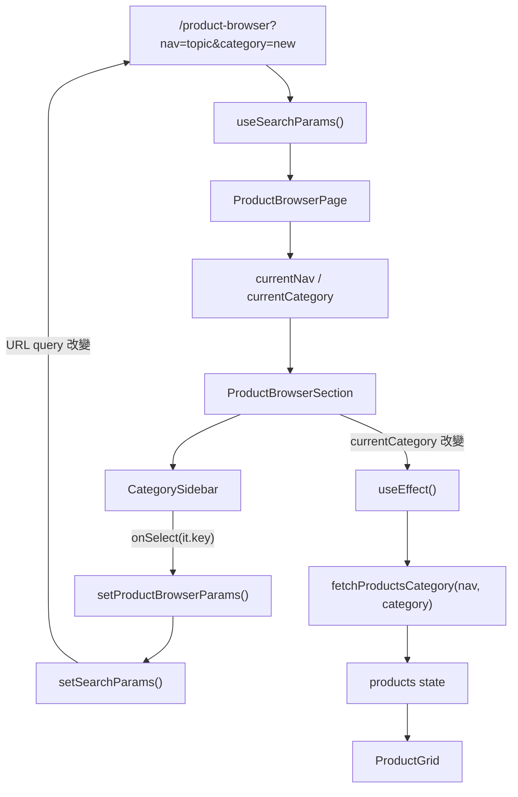

# URL Search Params 共用教學

這份文件說明 HappyShop 前端如何使用 URL query string 管理商品瀏覽頁狀態。

核心觀念：

> `useSearchParams()` 是把狀態放在網址上，例如目前選到哪個 nav、哪個 category。

例如：

```text
/product-browser?nav=topic&category=new
```

其中：

```text
nav=topic
category=new
```

就是目前商品瀏覽頁的狀態。

---

## 1. useSearchParams 是什麼？

位置：

```text
src/features/productBrowser/pages/ProductBrowserPage.jsx
```

目前程式：

```js
const [searchParams, setSearchParams] = useSearchParams();
```

可以理解成：

```text
searchParams：讀取目前 URL ? 後面的 query 參數
setSearchParams：修改目前 URL ? 後面的 query 參數
```

所以如果網址是：

```text
/product-browser?nav=topic&category=new
```

那麼：

```js
searchParams.get("nav");
```

會得到：

```text
topic
```

而：

```js
searchParams.get("category");
```

會得到：

```text
new
```

---

## 2. 商品瀏覽頁如何從 URL 讀狀態？

`ProductBrowserPage` 會把 URL query 轉成畫面需要的狀態：

```js
const currentNav = searchParams.get("nav") ?? "all";
const items = defaultDatas[currentNav] ?? [];
const currentCategory = searchParams.get("category") ?? items[0]?.key;
```

意思是：

```text
currentNav：目前選到哪個上方導覽分類
items：該 nav 底下有哪些左側分類
currentCategory：目前選到哪個左側分類
```

如果 URL 沒有帶 `nav`：

```text
/product-browser
```

就會使用預設值：

```js
currentNav = "all";
```

如果 URL 沒有帶 `category`，就會使用目前 nav 底下第一個分類：

```js
currentCategory = items[0]?.key;
```

---

## 3. URL 狀態如何傳到 ProductBrowserSection？

`ProductBrowserPage` 會把這些狀態傳給 `ProductBrowserSection`：

```jsx
return (
  <ProductBrowserSection
    title={title}
    items={items}
    currentNav={currentNav}
    currentCategory={currentCategory}
    searchParams={searchParams}
    setSearchParams={setSearchParams}
  />
);
```

所以 `ProductBrowserSection` 不需要自己重新解析 URL，它直接接收：

```text
currentNav
currentCategory
searchParams
setSearchParams
```

---

## 4. 點擊分類時發生什麼事？

位置：

```text
src/features/productBrowser/sections/ProductBrowserSection.jsx
```

使用者點擊左側分類時，會觸發：

```js
const handleSelect = (k) => {
  setProductBrowserParams({
    searchParams,
    setSearchParams,
    nav: currentNav,
    category: k,
  });
};
```

這裡的 `k` 是使用者點到的分類 key。

例如使用者點到：

```text
new
```

那就會呼叫：

```js
setProductBrowserParams({
  nav: currentNav,
  category: "new",
});
```

---

## 5. setProductBrowserParams 做了什麼？

位置：

```text
src/features/productBrowser/utils/productBrowserNav.js
```

目前程式：

```js
export function setProductBrowserParams({
  searchParams,
  setSearchParams,
  nav,
  category,
  replace = true,
}) {
  const sp = buildProductBrowserSearchParams(searchParams, { nav, category });
  setSearchParams(sp, { replace });
}
```

它做兩件事：

```text
1. 建立新的 URLSearchParams
2. 用 setSearchParams 寫回網址
```

所以它不是直接改畫面，而是先改 URL。

URL 改變後，React Router 會讓相關頁面重新 render。

---

## 6. 為什麼要先複製 URLSearchParams？

`buildProductBrowserSearchParams` 裡面有：

```js
const sp = new URLSearchParams(searchParams);
```

意思是：

```text
先複製目前 URL query
再在複製品上修改
最後把複製品交給 setSearchParams
```

接著：

```js
Object.entries(patch).forEach(([key, value]) => {
  if (value === undefined || value === null || value === "") sp.delete(key);
  else sp.set(key, String(value));
});
```

意思是：

```text
如果 value 是空的，就從 URL 刪掉該參數
如果 value 有值，就寫入或覆蓋該參數
```

例如：

```js
buildProductBrowserSearchParams(searchParams, {
  nav: "topic",
  category: "new",
});
```

會產生：

```text
?nav=topic&category=new
```

---

## 7. setSearchParams 後為什麼畫面會更新？

流程是：

```text
使用者點分類
-> handleSelect(k)
-> setProductBrowserParams(...)
-> buildProductBrowserSearchParams(...)
-> setSearchParams(sp)
-> URL query 改變
-> ProductBrowserPage 重新 render
-> currentCategory 變成新的分類
-> ProductBrowserSection 收到新的 currentCategory
-> useEffect 重新抓商品資料
-> ProductGrid 顯示新的商品
```

也就是說：

> `setSearchParams()` 改的是 URL，但 URL 也是 React Router 管理的狀態，所以 URL 改變會造成頁面重新 render。

---

## 8. fetchProductsCategory 為什麼只需要 nav 和 category？

位置：

```text
src/features/productBrowser/sections/ProductBrowserSection.jsx
```

目前程式：

```js
const remoteProducts = await fetchProductsCategory({
  nav: currentNav,
  category: currentCategory,
  signal: controller.signal,
});
```

這裡不是要抓「某一筆商品」，而是要抓「某個分類底下的商品列表」。

例如：

```js
{
  nav: "topic",
  category: "new"
}
```

意思是：

```text
請取得 topic / new 這個分類下的商品列表
```

回傳結果應該是一個商品陣列：

```js
[
  { productId: "p1", name: "商品 A", category: "new" },
  { productId: "p2", name: "商品 B", category: "new" },
  { productId: "p3", name: "商品 C", category: "new" },
]
```

然後：

```js
setProducts(normalizedProducts);
```

再交給：

```jsx
<ProductGrid products={products} />
```

把多筆商品卡片顯示出來。

---

## 9. 商品列表與商品詳細頁的分工

商品瀏覽頁只負責抓一批商品：

```text
頁面：/product-browser?nav=topic&category=new
條件：nav + category
用途：顯示商品列表
結果：商品 array
```

商品詳細頁才負責抓單一商品：

```text
頁面：/products/:productId/:title
條件：productId
用途：顯示商品詳細資訊
結果：單一商品 object
```

所以「我要哪一筆商品」不是在 `ProductBrowserSection` 決定，而是在使用者點擊商品卡片後，由商品詳細頁根據 `productId` 決定。

整體流程：

```text
/product-browser?nav=topic&category=new
-> fetchProductsCategory(nav, category)
-> 得到 new 分類下的一批商品
-> ProductGrid 顯示商品卡片
-> 使用者點某張商品卡
-> navigate("/products/:productId/:title")
-> ProductDetailSection 用 productId 抓單一商品
```

---

## 10. URL 修正邏輯

`ProductBrowserPage` 裡還有一段用來修正錯誤 URL：

```js
useEffect(() => {
  const sp = new URLSearchParams(searchParams);

  if (!defaultCategory) {
    if (!categoryInUrl) return;
    sp.delete("category");
    setSearchParams(sp, { replace: true });
    return;
  }

  const isValidCategory = items.some((item) => item.key === categoryInUrl);
  if (isValidCategory) return;

  sp.set("nav", currentNav);
  sp.set("category", defaultCategory);
  setSearchParams(sp, { replace: true });
}, [categoryInUrl, currentNav, defaultCategory, items, searchParams, setSearchParams]);
```

它的目的：

```text
如果 URL 裡的 category 不存在或不合法，
就自動改成目前 nav 底下的預設 category。
```

例如：

```text
/product-browser?nav=topic&category=wrong
```

如果 `wrong` 不是合法分類，就會被修正成：

```text
/product-browser?nav=topic&category=<topic 的第一個分類>
```

這可以避免畫面出現不存在分類或空白狀態。

---

## 11. replace: true 是什麼？

你會看到：

```js
setSearchParams(sp, { replace: true });
```

`replace: true` 的意思是：

```text
用新的 URL 取代目前的瀏覽紀錄
```

如果沒有 `replace: true`，每次點分類都會新增一筆瀏覽器 history。

例如使用者連點：

```text
new -> hot -> sale -> charity
```

沒有 replace 時，按上一頁可能會一個分類一個分類回去。

有 replace 時，通常會讓瀏覽紀錄比較乾淨。

---

## 12. 圖解：URL 狀態到商品列表



---

## 13. 一句話總結

`useSearchParams` 讓商品瀏覽頁把「目前選到哪個分類」存在 URL 上。

```text
讀取：searchParams.get("nav") / searchParams.get("category")
修改：setSearchParams(sp)
結果：URL 改變 -> 頁面重新 render -> 重新抓商品列表
```

它適合用在這種狀態：

```text
分類
排序
搜尋關鍵字
頁碼
篩選條件
```

因為這些狀態放在 URL 上後，使用者可以：

```text
重新整理不會消失
複製網址分享給別人
用瀏覽器上一頁/下一頁回到狀態
```
